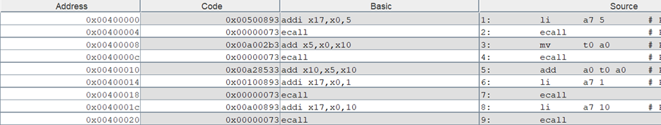
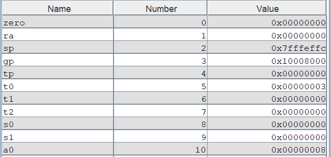
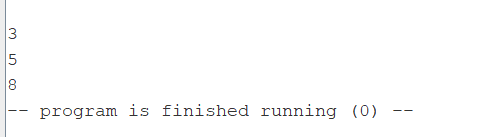

Отчёт:
1) Рассмотрим первую программу, ассемблируем код:

3) Запускаем программу, вводим два числа, 3 и 5, их сумма - 8 в регистре a0:

4) Псевдоинструкции:
- li      a7 5
- mv      t0 a0
- li      a7 1
- li      a7 10
4) Типы комманд:
  - 1: i-type
  - 2: ecall
  - 3: r-type
  - 4 ecall
  - 5: r-type
  - 6: i-type
  - 7: ecall
  - 8: i-type
  - 9: ecall
5) Системные вызовы в программах:
- 5: ReadInt
- 1: PrintInt
- 10: Exit
- 4: PrintString
