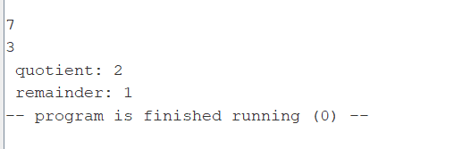
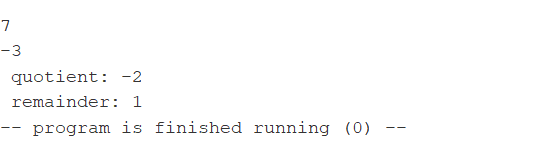
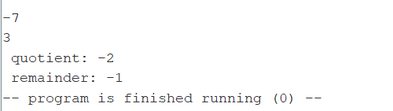
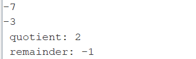
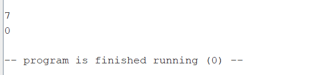

Отчёт:
1) Сначала написал программу на языке с++(код в этой же папке - Homework2/division.cpp)
2) Ориентируясь на эту программу, писал ее на языке ассемблера(код c комментариями в этой же папке - Homework2/division.asm)
3) В самой реализации учитываются 4 случая, в зависимости от знаков входных данных n и d:
   Если n>0, то в цикле while условие n-d>=0, если n<0, то условие n+d>=0;
   Если d<0, меняем его знак, и меняем знак для увеличения счетчика (переменная m, которая меняет счетчик-частное q, чтобы оптимизировать код и вместо 4 if написать два для n):
4) Получаются 4 тестовых случая для корректных данных, (два знака у n и d) и 1 случай некорретных данных, когда d=0:
   - n>0, d>0 
   - n>0,d<0 
   - n<0,d>0 
   - n<0,d<0 
   - d=0, exit call 
5) Все тестовые случаи совпали с вызовами % и / в с++, а деление на 0 отбрасывается.
