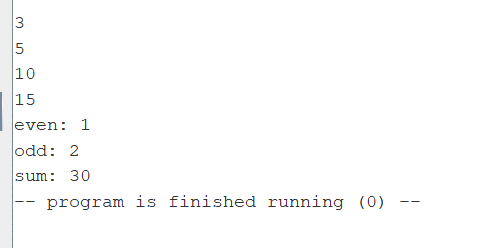
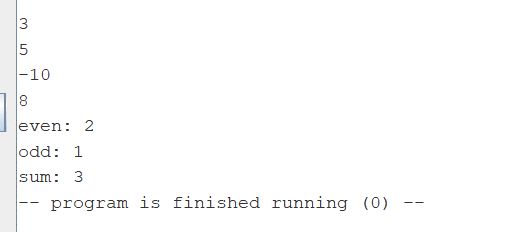
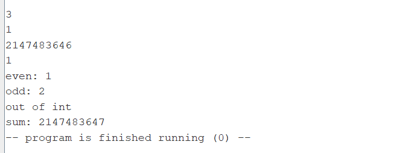
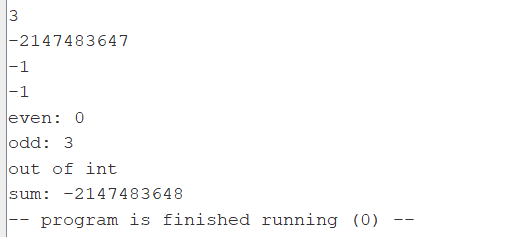

Отчёт:
(код с комментариями в файле array-sum.asm)
1) Выделил память для массива из максимум 10 чисел, запросил кол-во чисел массива, затем проверил что оно не больше 10, иначе присваиваем 10;
2) Заполнил массив, зная что все числа в диапазоне от -2^31 до 2^31 -1;
3) Сначала считаю кол-во четных и нечетных чисел, тут все просто влоб. Затем вывожу на экран полученные счетчики.
4) Теперь считаю сумму, но перед тем как добавлять новое число из массива к сумме, проверяю на переполнение:
   Переполнение случается в двух случаях. 1 - Старая сумма и новое число массива больше нуля, а их сумма меньше нуля(переполнилась и изменила знак) и 2 - Старая сумма и новое число массива меньше нуля, а их сумма больше нуля(аналогично). Если старая сумма и новое число разных знаков, то переполнения не будет, тк числа массива в корректном диапозоне.
   Таким образом, сначала узнаю знаки старой суммы и нового числа массива, и записываю их в регистры s6 И s7(1 - если число больше нуля, иначе 0). Затем с помощью xor выбираю случаи, когда знаки у старой суммы и нового числа совпадают. После провожу проверку, совпадает ли знак новой суммы и старой суммы, и если нет - переполнение случилось.
5) Вывожу сумму на экран. Если было переполнение, то вывожу последнюю корректную сумму.
6) Скриншоты тестов:
   - 1) Все числа больше 0 и в сумме не переполняются 
   - 2) Числа разных знаков, в сумме не переполняются 
   - 3) Переполнение на третьем элементе вверх, выводится последняя корректная сумма 
   - 4) Переполнение на третьем элементе вниз, выводится последняя корректная сумма 
