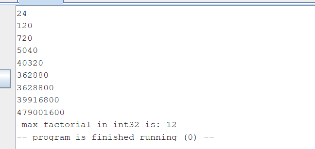

Отчёт:
I) Нерекурсивное решение:
  1) В основной программе сделал цикл, который начиная с 1 выводит на экран все факториалы, до тех пор пока не случится переполнение.
  2) Подсчет факториала реализован в подпрограмме fact, здесь я использовал только 2 t регистра, поээтому обошелся без стека, значения этих регистров не нужно хранить, результат в регистре a0. Сам факториал считал влоб циклом, в котором поочердно умножал на число от 1 до n.
  3) После получения значения факториала проверка на переполнение следующая: (n-1)! * n > M тогда и только тогда, когда (n-1)! > M/n, где n - текущее число, M = 2^31 -1; И если переполнение случилось, в переменной a0 хранится старый факториал, который последний выведен на экране.
  4) Скриншот вывода:

  
