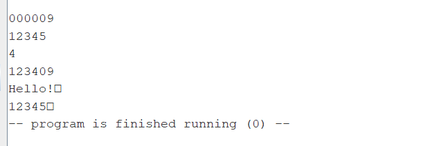

ДЗ6 

[Основная программа с комментариями](main.asm)

[Библиотека макросов с комментариями, там же макрос strncpy](macros.asm)

[Подпрограмма strncpy с комментариями](strncpy.asm)

В мейн вызов макросов и печать результата, 3 теста. Программа работае как со строками, введенными в консоли, так и со строками символов. 

После этого обернул strncpy в макрос, чтобы можно было дополнить библиотеку макросов cstring.

Скрин  тестов :

