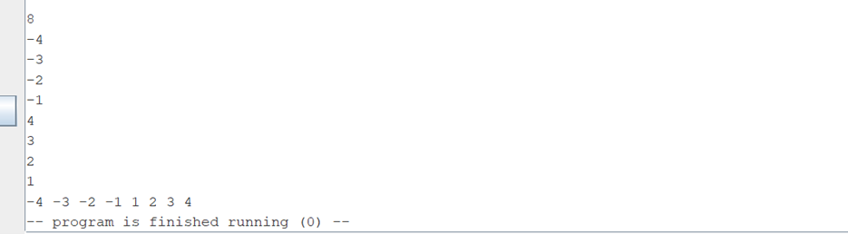
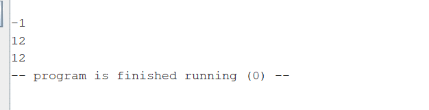
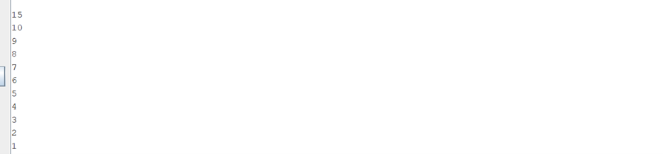
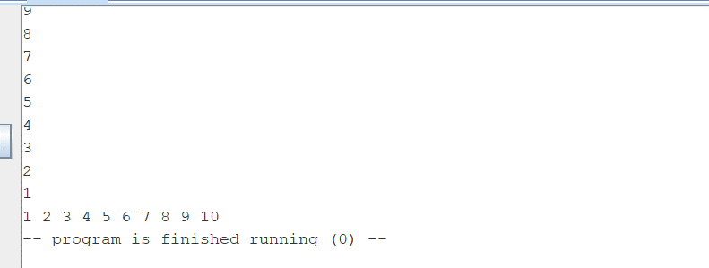

Тестовое покрытие.
Всего 3 случая, тк у меня просто сортировка, нет переполнения.
1) Размер от 1 до 10:

  
  Успешно сортируется.

2) Размер меньше 1:

  
  Размер меньше 1, поэтому ставится 1 и вводится 1 число, массив из одного числа сортируется)

3) Размер больше 10:

  
  
  Тут просто вводим 10 чисел, и они успешно сортируются.

4) Ну и результаты дополнительной тестирующей программы.
