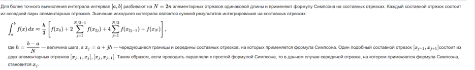

Калашников Егор Игоревич

БПИ226

Вариант 27

Условие: Разработать программу интегрирования функции $y = a + b ∗ x^{−2}$
(задаётся двумя числами а,b) в заданном диапазоне (задаётся так
же) методом Симпсона (точность вычислений = 0.0001).

Претендую на 10 баллов!

[Скриншоты тестов](tests.md)

[Программа на C++ c комментариями](code.cpp)

[Основная программа с комментариями](main.asm)

[Библиотека макросов с комментариями](macrolib.asm)

[Подпрограмма Integrate(сделал её в отдельном файле )](integrate.asm)

[Дополнительная тестирующая программа](testing.asm)

Отчёт:

0) Сначала решим задачу на С++, использовал метод Симпсона по следующему алгоритму(Составной формулой Симпсона):

1) на 4-5:
  - Ввод чисел a,b и границ интервала с клавиатуры.
  - Вызов подпрограммы интегрирования методом Симпсона, в ней реализован алгоритм программы на С++, при этом использовал подпрограмму для функции f(x) для удобства. 
  - Вывод результата.
2) на 6-7:
  - В подпрограммах(и макросах) использую парамметры, которые сохраняются на стек
  - А так же локальные переменные, которые тоже сохраняются на стек
  - Комментарии о параметрах и значенииях функции есть
3) на 8:
  - Разработанные подпрограммы поддерживают многократное использование с различными наборами исходных данных
  - Добавил дополнительную тестовую программу, результаты которой в файле с тестовым покрытием
  - Сравнил прогоны этой программы с результатами программы на С++.
4) на 9:
  - Ввод данных с клавиатуры и вывод на экран осуществляется макросами, а так же push и pop для стека тоже реализован макросами.
  - Обернул подпрограмму-функцию $y = a + b ∗ x^{−2}$ в макрос для удобства.
5) на 10:
  - Все макросы в отдельной библиотеке macrolib.asm
  - Подпрограма интегрирования тоже в отдельном файле.
  - Таким образом, программа разбита на несколько единиц компиляции. При этом макросы ввода–вывода составляют
унифицированные модули, используемые повторно как в программе, осуществляющей ввод исходных данных, так и в программе,
осуществляющей тестовое покрытие.

Конец!
