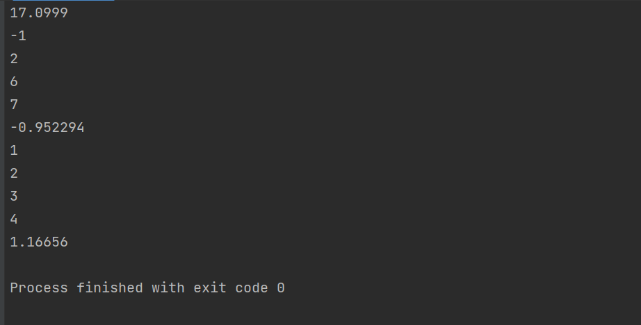

Тестовое покрытие (зависит от интервала):
1) $f(x) = 3 + 4x^{-2}$, интервал - [5,3]

  $\int_3^5 f(x)dx = 6.53333$
  

Ответ с учетом точности 0.0001 верен.

2) $f(x) = 3 + 4x^{-2}$, интервал - [3,5](поменял местами границы)

$\int_5^3 f(x)dx = -6.53333$

Тут тоже все верно.

3) $f(x) = $f(x) = 3 + 4x^{-2}$, интервал - [-3,-5] (отрицательные границы)$

$\int_{-3}^{-5} f(x)dx = -6.53333$

И тут верно.

4) $f(x) = $f(x) = 3 + 4x^{-2}$, интервал - [-3,5]$

$\int_{-3}^5 f(x)dx = \infty$

Тут бесконечность, тк есть выколотая точка  - 0 внутри интервала, т.е. функция не непрерывна на данном интервале.

5) Сравнение результатов тестовой программы и программы на С++:

Совпадает! (только вот на некоторых тестах может пройти около 30-60 сек, тк точность 0.0001 в некоторых случаях считается долго, так что не пугайтесь!)
