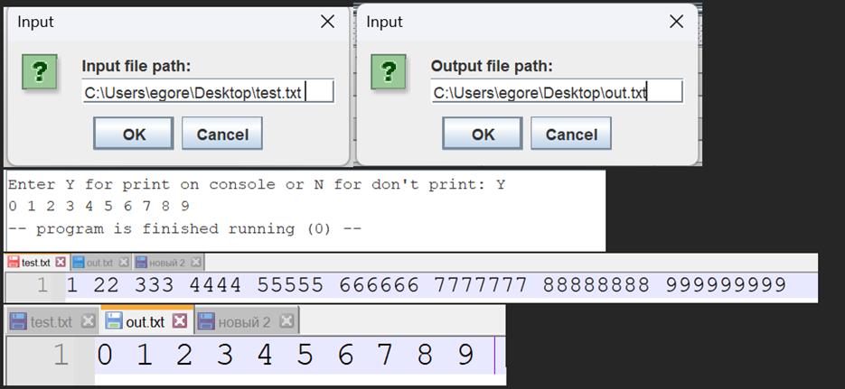
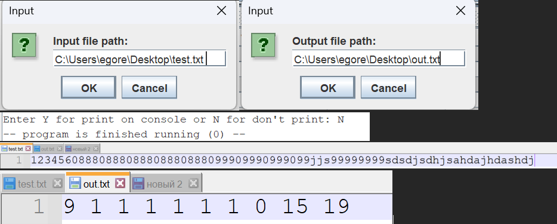
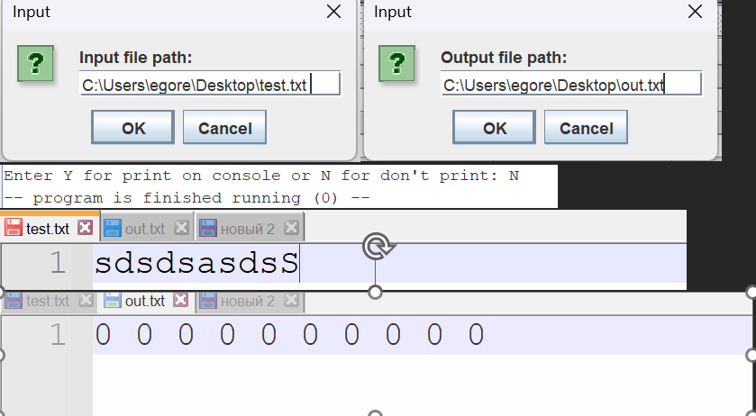

1) Сначала через диалоговое окно запрашиваю имя файл с входными данными.
2) После через диалоговое окно запрашиваю имя output файла.
3) Далее в консоли появляется диалог для вывода ответа на консоль.
4) Счетчики записаны в файл.

1 тест - простой:

2 тест - побольше:

3 тест - нет цифр:

